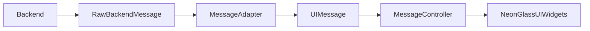

### Constraints (confirmed)

- **No backend/business-logic changes**: keep all existing realtime/socket logic, send/receive APIs, delivery/read logic, timestamps, image upload, block/report as-is.
- **Backend schemas immutable**: do not change response/request shapes.
- **Mapping via adapter**: Backend → `RawBackendMessage` → `MessageAdapter` → `UIMessage`.
- **State machine derived from backend states**: sent/delivered/seen/failed/pending/deleted come from backend fields/events; UI computes only presentation state (grouping, active/pressed, fast-scroll suppression, etc.).
- **UI stateless for message content**: widgets render from `UIMessage` + controller state; no mutation of message payloads in widgets.
- **Forbidden**: audio message recording/playback, video messaging, voice/video calls, mic/camera icons, waveform UI, call buttons/states.
- **Allowed**: text messages, image upload/sending, block + report.
- **Sound**: **hooks only** (call into a notifier/callback; do not implement playback system or add AV scaffolding).

### Target architecture

### UI components to build (from `chat-ui-impl.md`, adjusted for forbidden controls)

- **Screen root & layers**
  - `BackgroundLayer`: multi-stop gradient + drifting blurred blobs + (optional) noise film + scroll parallax.
  - `AmbientParticlesLayer`: subtle floating dust behind messages.
  - `LightingOverlayTopcoat`: vignette + interaction ripples + message “bounce lighting”.
- **AppBar (floating glass)**
  - Back button (glass)
  - Avatar (glass + neon ring + presence pulse)
  - Name + status
  - Right side: **overflow menu (⋮)** with existing **Block** + **Report** actions.
  - **No call/video buttons**.
- **Message list**
  - Incoming/outgoing neon-glass bubbles (rim glow, blur, shadow)
  - **Inline timestamp inside bubble bottom-right** with active/idle opacity rules and fast-scroll suppression
  - Typing indicator (3 dots loop)
  - Error/failed message visuals (warm rim + retry menu) without changing send logic
  - History-load animations without scroll jumps
- **Input bar (floating glass pill)**
  - Left: **attach icon** for existing image picker/upload flow
  - Center: text field
  - Right: send button
  - **No mic/camera/recording/attachment panels beyond image**

### Interaction + animation/state systems

- **ChatScreenStateMachine** (Idle/Scrolling(Fast/Settle)/InputActive(Typing)/MessageEvent(Incoming/Outgoing/Delivered/Seen/Failed/Retry)) driven by:
  - scroll velocity (fast-scroll suppression)
  - keyboard focus
  - backend message status updates
- **Scroll-linked effects**
  - background parallax drift
  - reduce blur/glow/particles + timestamp opacity during fast scroll
- **Bubble animations**
  - arrival scale/opacity/glow sequence per spec timing
  - unread/read glow attenuation derived from backend read status
- **Gestures**
  - long-press bubble: elevate timestamp opacity + show retry/resend/delete where already supported
- **Sound hooks only**
  - expose callbacks like `onMessageSent()`, `onMessageReceived()`, `onMessageSeen()`; call them from controller/state transitions but do not implement audio playback.

### Integration steps (no backend changes)

- **Audit existing chat wiring** in `[lib/Screens/chatpage/ChatScreenpusher.dart]` and the current chat controller/model usage.
- **Add adapter layer**
  - Define `RawBackendMessage` wrapping existing backend model(s) (no schema change).
  - Implement `MessageAdapter` → `UIMessage` mapping (including status fields + timestamp parsing).
- **Refactor controller to expose UI-ready state**
  - Maintain a single `RxList<UIMessage>` (or equivalent) and derived presentation values (grouping, active message id, fast-scroll flag).
- **Replace the screen widgets** with modular NeonGlass widgets following the layer order and token-driven styling.
- **Preserve existing actions**
  - Block/report: wire overflow menu to existing methods.
  - Image upload: keep existing pick/upload pipeline; only re-skin the trigger control.
- **Validation**
  - Ensure message send/receive, delivery/read updates, image sending, block/report all behave identically.
  - Ensure no forbidden UI elements exist.

### Files likely involved

- `[lib/Screens/chatpage/ChatScreenpusher.dart]` (screen rebuild + wiring)
- Existing chat controller/model files (where messages/status are handled)
- New UI modules under `[lib/ui/chat_neon_glass/]` (layers, bubbles, app bar, input bar)
- New adapter types under `[lib/ui/chat_neon_glass/adapters/]` (or similar)
- Token definitions under `[lib/ui/tokens/]` per spec